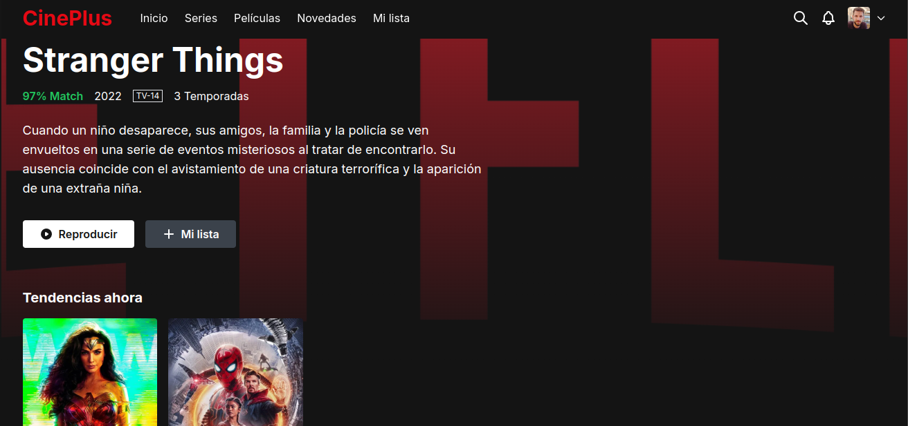

# CinePlus

## Descripción
CinePlus es un catálogo de películas en línea que ofrece una experiencia de usuario intuitiva y atractiva. La interfaz está diseñada para facilitar la navegación y la búsqueda de contenido, permitiendo a los usuarios disfrutar de sus películas y series favoritas de manera sencilla.

## Características
- Diseño responsivo que se adapta a diferentes dispositivos.
- Sección de héroe con imágenes de alta calidad y detalles de la película.
- Navegación fácil con un menú claro y accesible.
- Secciones para tendencias, populares y continuar viendo.
- Carga de contenido con un esqueleto de carga para mejorar la percepción de rendimiento.

## Instrucciones de Instalación
1. Clona el repositorio:
   ```bash
   git clone https://github.com/Chris3riel/cineplus.git
   ```
2. Navega al directorio del proyecto:
   ```bash
   cd cineplus
   ```
3. Abre el archivo `index.html` en tu navegador.

## Uso
Abre el archivo `index.html` en un navegador web para ver la interfaz de CinePlus. Navega a través de las diferentes secciones para explorar el catálogo de películas.

## Licencia
Este proyecto está bajo la Licencia MIT. Consulta el archivo `LICENSE` para más detalles.
